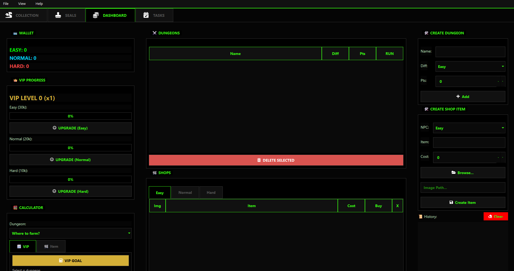

# 🦖 Digital Nexus Tracker (Unofficial)

  

Uma aplicação desktop completa para gerir progresso, economia e tarefas no servidor privado **Digital Nexus Online** (DNO).
Desenvolvido para eliminar a necessidade de folhas de Excel e facilitar o *min-maxing* do jogo.

---

## 📸 Screenshots

*(O teu Dashboard Financeiro com cálculo de VIP)*

---

## 🔥 Funcionalidades Principais

* **👑 Gestor de Economia VIP:** Calcula automaticamente quantos pontos (Easy/Normal/Hard) faltam para o próximo nível VIP.
* **🛒 Lojas Dinâmicas:** Adiciona itens e preços manualmente conforme o servidor atualiza (com suporte a imagens).
* **💾 Sistema de Backup:** Importa/Exporta o teu progresso via JSON. Nunca percas o save.
* **📅 Daily & Weekly Tasks:** Checklist com reset automático para não perderes tickets.
* **🎨 Temas Visuais:** Escolhe entre o modo Default (Azul) ou Nexus (Verde Oficial).
* **🦕 Coleção & Seals:** Monitoriza quais Digimons e Selos já desbloqueaste.

## 🛠️ Tecnologias Usadas

* **Linguagem:** Python 3
* **Interface:** PySide6 (Qt for Python)
* **Base de Dados:** SQLite3
* **Ícones:** QtAwesome (FontAwesome)
* **Build:** PyInstaller

## 🚀 Como Usar

1.  Baixa a versão mais recente em "Releases".
2.  Extrai a pasta.
3.  Executa o `DMOTracker.exe`.
4.  Cria o teu perfil e começa a farmar!

---
*Desenvolvido por [Vicius](https://github.com/Brunom83)*
